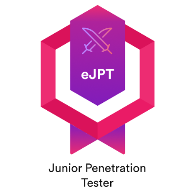
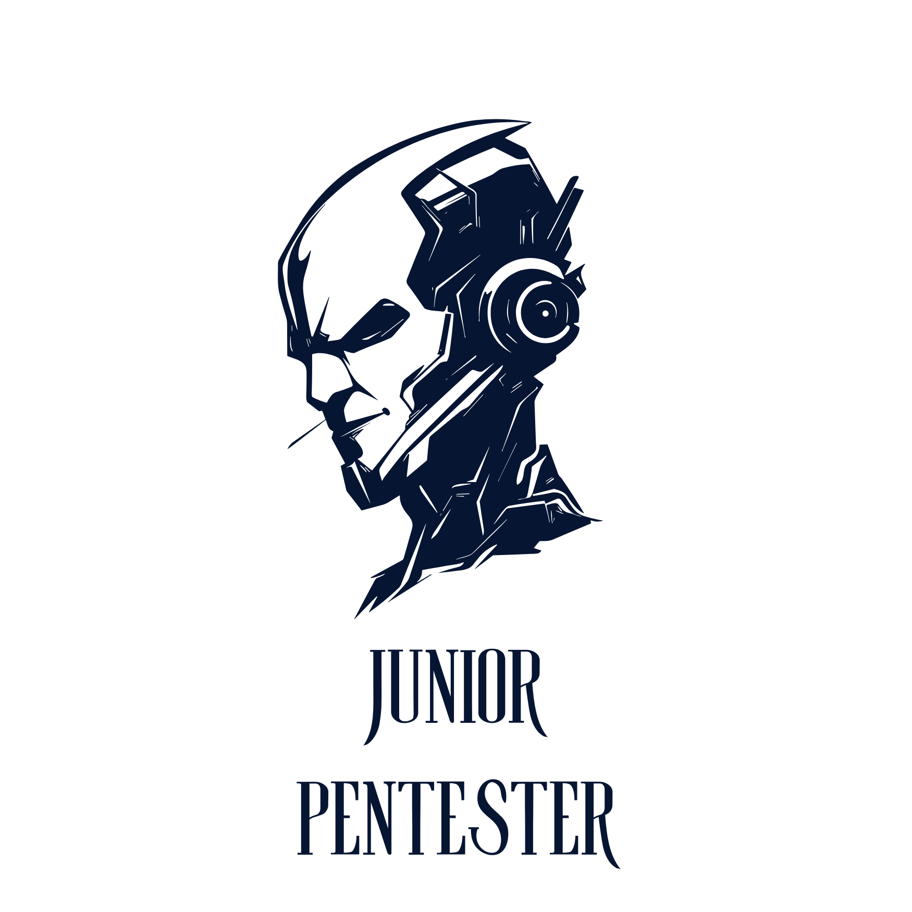

 

<h1 align="center">⚔️ Damián Carrillo Arjones</h1>

  

  
  
  

---

### 🛡️ Operative Profile

<table align="center">
  <tr>
    <td width="33%" align="center">
       
      <b>eJPT Certified</b> 
      <i>INE Security</i>
    </td>
    <td width="33%" align="center">
   
  <b>Grado Sup. DAM</b> 
  <i>App Development</i>
</td>
   <td width="33%" align="center">
       
      <i>Offensive Security</i>
    </td>
  </tr>
</table>

---

### 📊 Threat Intel Dashboard (GitHub Stats)

  
  

  

---

### 🛠️ Tactical Stack & Arsenal

<table width="100%">
  <tr>
    <td width="50%" valign="top">
      <h4>⚡ Dev & Core Tech (DAM)</h4>
      
    </td>
    <td width="50%" valign="top">
      <h4>🎯 Hacking Skills (eJPT)</h4>
      <code><b>Network:</b> Arp Poisoning, Routing, Wireshark</code> 
      <code><b>Web:</b> SQLi, XSS, Path Traversal</code> 
      <code><b>Exploitation:</b> Metasploit, Reverse Shells</code> 
      <code><b>Post-Exploit:</b> Privilege Escalation, Hash Cracking</code>
    </td>
  </tr>
</table>

---

### 📈 Deployment Activity

  

  

